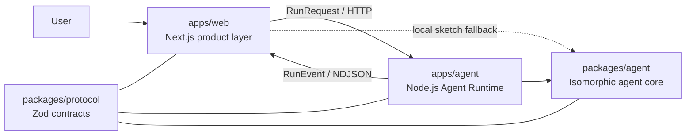

<div align="center">
  <h1>Nivik</h1>
  <p><strong>AI-native diagramming — describe it, get a clear picture.</strong></p>
  <p>Turn intent into editable diagrams through a streaming, contract-first agent workflow.</p>

  <p>
    <strong>English</strong> · <a href="./README.zh-CN.md">简体中文</a>
  </p>

  <p>
    
    = 20.9" />
    
  </p>
  <p>
    
    
    
    
  </p>
</div>

## Overview

Nivik is an AI-native diagramming workspace built around a simple idea: describe what you want to communicate, then refine the result as an editable diagram.

Instead of coupling AI calls directly to UI components, Nivik separates the product experience, the Node.js agent runtime, and the isomorphic agent core. A shared Zod protocol keeps requests and streamed events validated across every boundary.

> [!IMPORTANT]
> Nivik is in early development. The UI shell, streaming protocol, harness kernel, Node.js runtime, and end-to-end mock generation flow are implemented. Real model providers, the canonical diagram IR, persistence, layout, and renderer adapters are still being built.

## Highlights

- **AI-first canvas workflow** — compose a request and watch the diagram form through explicit execution stages.
- **Streaming by default** — the runtime returns validated `RunEvent` records over NDJSON instead of waiting for one large response.
- **Runtime isolation** — Next.js owns the product layer; a dedicated Hono service owns long-running agent execution, cancellation, and future provider proxying.
- **Contract-first communication** — `RunRequest`, `RunEvent`, runtime responses, and error codes have one Zod source of truth.
- **Harness engineering** — stage budgets, timeouts, cancellation, recoverable retries, usage accounting, and secret redaction live in the agent core.
- **Resilient development flow** — when the runtime is unavailable, the web app can fall back to a local sketch instead of blocking the canvas.
- **Product-ready shell** — diagram library, templates, integrations, settings, and canvas routes share a reusable component system.

## Architecture



The dependency direction is intentionally narrow:

1. `apps/web` handles navigation, local product state, settings, and streamed UI updates.
2. `apps/agent` exposes the HTTP runtime, owns run lifecycle and CORS, and hosts the agent core.
3. `packages/agent` stays independent of Node.js and DOM globals so the same core can later run in a browser Worker.
4. `packages/protocol` is the shared boundary contract used by every layer.

## Repository map

| Path | Package | Responsibility |
| --- | --- | --- |
| `apps/web` | `@nivik/web` | Next.js 16 product UI: library, templates, integrations, settings, and canvas workspace. |
| `apps/agent` | `@nivik/agent-runtime` | Hono-based Node.js runtime with health, run, status, cancel, CORS, and NDJSON streaming endpoints. |
| `packages/protocol` | `@nivik/protocol` | Zod schemas, error codes, runtime contracts, and the NDJSON codec. |
| `packages/agent` | `@nivik/agent` | Isomorphic agent interfaces, harness kernel, budgets, retries, cancellation, redaction, and mock agent. |
| `packages/ui` | `@nivik/ui` | Design tokens, palettes, and shared product components. |
| `.githooks` | — | Versioned commit policy and local hook implementation. |

## Getting started

### Requirements

- Node.js `>= 20.9` (Node.js 24 recommended)
- pnpm 10 through Corepack

### Install and run

```bash
git clone https://github.com/IvanCodesDev/Nivik.git
cd Nivik
corepack enable
pnpm install
pnpm dev
```

The development command starts both applications:

- Web product: [http://localhost:3000](http://localhost:3000)
- Agent Runtime health check: [http://127.0.0.1:3400/healthz](http://127.0.0.1:3400/healthz)

Run only one side when needed:

```bash
pnpm dev:web
pnpm dev:agent
```

## Commands

| Command | Description |
| --- | --- |
| `pnpm dev` | Start the web product and agent runtime in parallel. |
| `pnpm dev:web` | Start only the Next.js application. |
| `pnpm dev:agent` | Start only the Node.js Agent Runtime. |
| `pnpm build` | Build all applications and packages. |
| `pnpm start` | Serve both production builds. |
| `pnpm typecheck` | Run TypeScript checks in every workspace package. |
| `pnpm lint` | Check formatting and lint rules with Biome. |
| `pnpm lint:fix` | Apply safe Biome formatting and lint fixes. |
| `pnpm test` | Run the Vitest test suite. |
| `pnpm hooks:check` | Run repository pre-commit policy checks without committing. |

## Configuration

| Variable | Used by | Default | Purpose |
| --- | --- | --- | --- |
| `NEXT_PUBLIC_NIVIK_AGENT_URL` | Web | `http://localhost:3400` | Agent Runtime base URL embedded at build time. |
| `NIVIK_AGENT_HOST` | Runtime | `127.0.0.1` | Runtime bind address. |
| `NIVIK_AGENT_PORT` | Runtime | `3400` | Runtime HTTP port. |
| `NIVIK_WEB_ORIGIN` | Runtime | `http://localhost:3000` | Comma-separated CORS allow-list. |
| `NIVIK_MOCK_PACE_MS` | Runtime | `350` | Delay between scripted mock events during development. |

## Runtime API

| Method | Route | Purpose |
| --- | --- | --- |
| `GET` | `/healthz` | Runtime health, version, protocol, and run counts. |
| `POST` | `/v1/runs` | Start a run and stream `RunEvent` records as NDJSON. |
| `GET` | `/v1/runs/:id` | Read the retained summary for a run. |
| `POST` | `/v1/runs/:id/cancel` | Cancel a running execution. |

## Engineering principles

- **Strict TypeScript** across every workspace package.
- **Isomorphic core**: `packages/agent` and `packages/protocol` do not access Node.js or DOM globals directly.
- **Host access by dependency injection** through `AgentDeps`.
- **Validated boundaries**: malformed requests and streamed events fail at the protocol edge.
- **Deterministic termination**: a pipeline emits usage followed by exactly one terminal event.
- **Local-first secrets**: provider keys are not persisted by the current product settings flow.
- **Small, explicit dependencies** managed as a pnpm workspace.

## Repository policy

`pnpm install` activates the versioned hooks in `.githooks`. This repository currently enforces a single-author policy:

```bash
git config user.name "IvanCodesDev"
git config user.email "<your email>"
```

The hooks reject:

- any author or committer other than `IvanCodesDev`, especially coding-agent and bot identities;
- `Co-authored-by` and generated-by-agent attribution in commit messages;
- private documentation under `docs/`, dependency/build output, environment files, agent instruction files, QA artifacts, and credential files;
- oversized staged files and content that resembles an API key or private key.

The same identity, message, and path policy is checked again before push. Rules are defined in [`.githooks/policy.json`](./.githooks/policy.json).

## Roadmap

- Canonical diagram IR and transactional Change Sets
- Local persistence and recovery
- Real model providers, BYOK, and Runtime proxying
- Layout engine and renderer adapters
- Source ingestion and richer review/repair loops
- Browser Worker execution for fully local agent runs

## Project status

Phase 0 is in progress. The React product shell and the three-layer runtime architecture are operational, including an end-to-end streamed mock run from the canvas to the Node.js runtime and back. Diagram generation still uses mock actions until the IR and provider integrations land.

## License

No open-source license has been published for Nivik yet.
