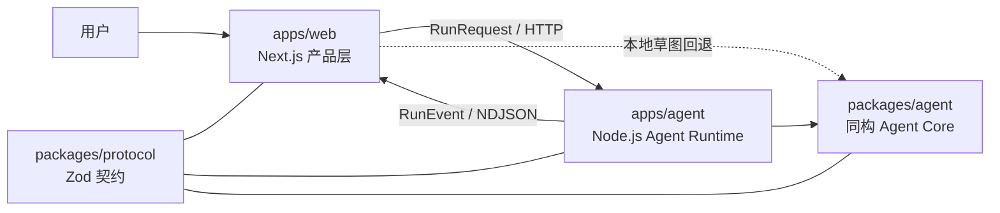

# Nivik

**AI 原生图表工具——描述你的想法，得到一张清晰的图。**

通过流式、契约优先的 Agent 工作流，将意图转化为可编辑图表。

[English](./README.md) · **简体中文**

 

   

## 项目概览

Nivik 是一个 AI 原生图表工作台，建立在一个简单的理念之上：描述你想表达的内容，然后在可编辑图表中继续完善结果。

Nivik 没有把 AI 调用直接耦合在 UI 组件里，而是将 Web 产品层、Node.js Agent Runtime 与同构 Agent Core 分开。共享的 Zod 协议会验证跨越每一层边界的请求和流式事件。

> [!IMPORTANT]
> Nivik 目前处于早期开发阶段。UI 外壳、流式协议、Harness 内核、Node.js Runtime 和端到端模拟生成流程已经实现。真实模型提供商、标准图表 IR、持久化、布局引擎和渲染器适配器仍在开发中。


## 核心亮点

- **AI 优先的画布工作流**——输入你的需求，通过明确的执行阶段观察图表逐步生成。
- **默认流式传输**——Runtime 通过 NDJSON 返回经过验证的 `RunEvent`，无需等待一个庞大的最终响应。
- **Runtime 隔离**——Next.js 负责产品层；独立的 Hono 服务负责长时间 Agent 执行、取消操作以及后续的模型代理。
- **契约优先通信**——`RunRequest`、`RunEvent`、Runtime 响应和错误码只有一个 Zod 真相来源。
- **Harness Engineering**——阶段预算、超时、取消、可恢复重试、用量统计和敏感信息脱敏都位于 Agent Core。
- **弹性的开发流程**——Runtime 不可用时，Web 应用可以回退到本地草图，不会让画布完全阻塞。
- **完整的产品外壳**——图表库、模板、集成、设置和画布路由共用一套可复用组件系统。


## 架构




依赖方向被有意收窄：

1. `apps/web` 负责导航、本地产品状态、设置以及流式 UI 更新。
2. `apps/agent` 暴露 HTTP Runtime，管理运行生命周期和 CORS，并承载 Agent Core。
3. `packages/agent` 不依赖 Node.js 和 DOM 全局对象，因此同一套核心未来可以运行在浏览器 Worker 中。
4. `packages/protocol` 是所有层共同使用的边界契约。


## 仓库结构


| 路径                  | 包名                     | 职责                                                            |
| ------------------- | ---------------------- | ------------------------------------------------------------- |
| `apps/web`          | `@nivik/web`           | Next.js 16 产品 UI：图表库、模板、集成、设置和画布工作台。                          |
| `apps/agent`        | `@nivik/agent-runtime` | 基于 Hono 的 Node.js Runtime，提供健康检查、运行、状态、取消、CORS 和 NDJSON 流式接口。 |
| `packages/protocol` | `@nivik/protocol`      | Zod Schema、错误码、Runtime 契约和 NDJSON 编解码器。                       |
| `packages/agent`    | `@nivik/agent`         | 同构 Agent 接口、Harness 内核、预算、重试、取消、脱敏和模拟 Agent。                  |
| `packages/ui`       | `@nivik/ui`            | 设计令牌、颜色体系和共享产品组件。                                             |
| `.githooks`         | —                      | 版本化 Git 提交策略及本地 Hook 实现。                                      |


## 快速开始


### 环境要求

- Node.js `>= 20.9`（推荐 Node.js 24）
- 通过 Corepack 使用 pnpm 10


### 安装并运行

```bash
git clone https://github.com/IvanCodesDev/Nivik.git
cd Nivik
corepack enable
pnpm install
pnpm dev
```

开发命令会同时启动两个应用：

- Web 产品：[http://localhost:3000](http://localhost:3000)
- Agent Runtime 健康检查：[http://127.0.0.1:3400/healthz](http://127.0.0.1:3400/healthz)

需要时也可以只启动一端：

```bash
pnpm dev:web
pnpm dev:agent
```


## 常用命令


| 命令                 | 说明                          |
| ------------------ | --------------------------- |
| `pnpm dev`         | 并行启动 Web 产品和 Agent Runtime。 |
| `pnpm dev:web`     | 仅启动 Next.js 应用。             |
| `pnpm dev:agent`   | 仅启动 Node.js Agent Runtime。  |
| `pnpm build`       | 构建所有应用与包。                   |
| `pnpm start`       | 运行两个生产构建。                   |
| `pnpm typecheck`   | 对每个工作区包执行 TypeScript 检查。    |
| `pnpm lint`        | 使用 Biome 检查格式和 Lint 规则。     |
| `pnpm lint:fix`    | 应用安全的 Biome 格式化和 Lint 修复。   |
| `pnpm test`        | 运行 Vitest 测试套件。             |
| `pnpm deps`        | 使用 dependency-cruiser 校验包依赖方向。 |
| `pnpm hooks:check` | 不创建提交，直接检查当前暂存区是否符合仓库策略。    |


## 配置


| 环境变量                          | 使用方     | 默认值                     | 用途                         |
| ----------------------------- | ------- | ----------------------- | -------------------------- |
| `NEXT_PUBLIC_NIVIK_AGENT_URL` | Web     | `http://localhost:3400` | 构建时写入的 Agent Runtime 基础地址。 |
| `NIVIK_AGENT_HOST`            | Runtime | `127.0.0.1`             | Runtime 监听地址。              |
| `NIVIK_AGENT_PORT`            | Runtime | `3400`                  | Runtime HTTP 端口。           |
| `NIVIK_WEB_ORIGIN`            | Runtime | `http://localhost:3000` | 以逗号分隔的 CORS 白名单。           |
| `NIVIK_MOCK_PACE_MS`          | Runtime | `350`                   | 开发阶段各个模拟事件之间的延迟。           |


## Runtime API


| 方法     | 路由                    | 用途                                |
| ------ | --------------------- | --------------------------------- |
| `GET`  | `/healthz`            | 获取 Runtime 健康状态、版本、协议版本和运行数量。     |
| `POST` | `/v1/runs`            | 启动一次运行，并以 NDJSON 流式返回 `RunEvent`。 |
| `GET`  | `/v1/runs/:id`        | 读取指定运行保留的摘要。                      |
| `POST` | `/v1/runs/:id/cancel` | 取消正在执行的运行。                        |


## 工程原则

- 所有工作区包都启用 **TypeScript 严格模式**。
- **同构核心**：`packages/agent` 和 `packages/protocol` 不直接访问 Node.js 或 DOM 全局对象。
- 通过 `AgentDeps` 进行**宿主能力依赖注入**。
- **验证所有边界**：格式错误的请求和流式事件会在协议边界失败。
- **确定性终止**：Pipeline 先发出用量事件，然后只发出一个终止事件。
- **密钥本地优先**：当前产品设置流程不会持久化模型提供商密钥。
- 使用 pnpm workspace 管理小而明确的依赖关系。


## 仓库提交策略

`pnpm install` 会启用 `.githooks` 中版本化的 Git Hook。当前仓库执行单一作者策略：

```bash
git config user.name "IvanCodesDev"
git config user.email "<你的邮箱>"
```

Hook 会拒绝：

- 任何不是 `IvanCodesDev` 的作者或提交者，尤其是 Coding Agent 和机器人身份；
- 提交消息中的 `Co-authored-by` 以及任何由 Agent 生成的署名；
- `docs/` 下的私有文档、依赖和构建产物、环境变量文件、Agent 指令文件、QA 产物及凭据文件；
- 过大的暂存文件，以及内容疑似 API Key 或私钥的文件。

在 Push 之前还会再次检查同一套身份、提交消息和路径策略。具体规则定义在 `[.githooks/policy.json](./.githooks/policy.json)`。

## 开发路线

- 标准图表 IR 与事务式 Change Set
- 本地持久化与恢复
- 真实模型提供商、BYOK 与 Runtime 代理
- 布局引擎与渲染器适配器
- 数据源导入与更完整的审查/修复循环
- 通过浏览器 Worker 完全在本地执行 Agent


## 项目状态

Phase 0 正在进行中。React 产品外壳与三层 Runtime 架构已经可以运行，包括从画布到 Node.js Runtime 再返回画布的端到端流式模拟运行。在 IR 和模型提供商集成完成之前，图表生成仍然使用模拟 Action。

## 许可证

Nivik 目前尚未发布开源许可证。